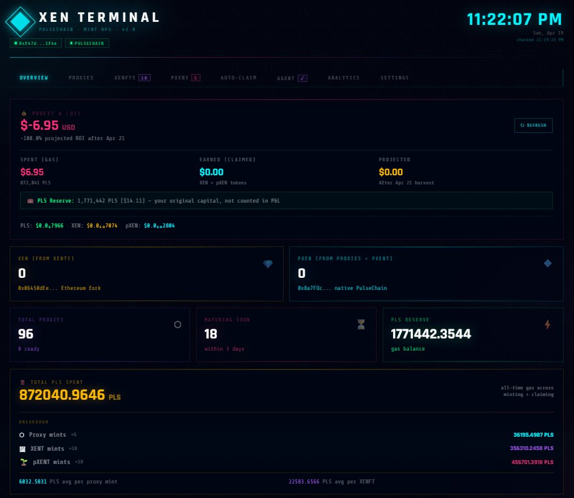
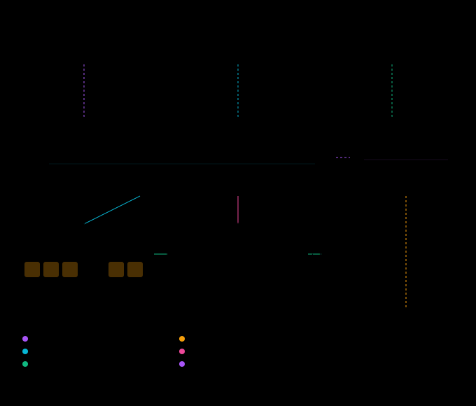
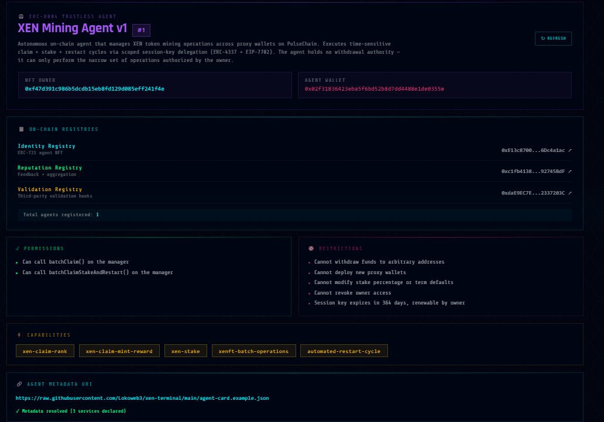
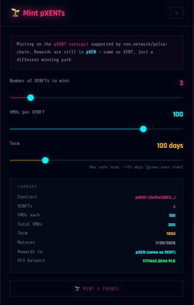
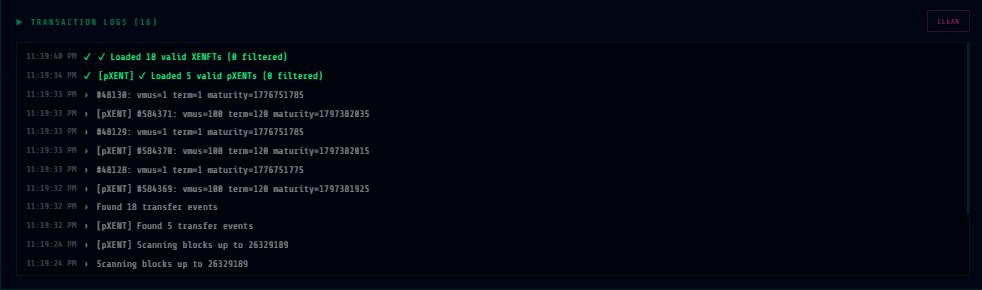

# XEN Terminal

**Fully-automated XEN mining on PulseChain using modern Ethereum account abstraction and the emerging agent identity standard.**

This project demonstrates how to combine six Ethereum standards — [ERC-4337](https://eips.ethereum.org/EIPS/eip-4337), [EIP-3074](https://eips.ethereum.org/EIPS/eip-3074), [EIP-7702](https://eips.ethereum.org/EIPS/eip-7702), [EIP-1167](https://eips.ethereum.org/EIPS/eip-1167), [EIP-5792](https://eips.ethereum.org/EIPS/eip-5792), and [ERC-8004](https://eips.ethereum.org/EIPS/eip-8004) — to build a 24/7 autonomous blockchain agent with a verifiable on-chain identity. The agent manages dozens of proxy wallets, executes time-sensitive on-chain operations, cannot be tricked into stealing funds, and exposes its credentials for third-party reputation and validation.

Built as a learning exercise and portfolio project. See [disclaimer](#disclaimer).

---

## Dashboard



*Real-time P&L card with live PulseX pricing, token balances, proxy wallet counts, and full gas breakdown across all operation types.*

---

## What it does

1. **Deploys** a manager smart contract that can create hundreds of mini proxy wallets
2. **Authorizes** an off-chain bot via session keys (can claim, cannot withdraw)
3. **Mints** pXEN in parallel across all proxies via a single transaction
4. **Claims** matured rewards automatically on a schedule
5. **Stakes** a percentage of claimed rewards for APY compounding
6. **Restarts** mints immediately after claims (zero downtime)
7. **Displays** everything in a real-time React dashboard
8. **Registers** the bot as an ERC-8004 trustless agent with verifiable identity

## Architecture



See [docs/architecture.md](docs/architecture.md) for the full breakdown.

### Emerging Standards

**ERC-8004 (Trustless Agents)** — The relayer bot is registered as an on-chain ERC-8004 agent with verifiable identity, optional reputation tracking, and a validation hook for third-party verification. This makes the agent discoverable and trustable by other systems without prior relationships. See [docs/erc8004-integration.md](docs/erc8004-integration.md).



*The dashboard resolves live agent identity from the on-chain registry, displays registered permissions and restrictions, and verifies that the published `agent-card.json` metadata is reachable.*

For analysis of other 2026 proposals (ERC-8211 Smart Batching, ERC-8126 Agent Verification, ERC-8199 Sandboxed Wallet) and why they are/aren't integrated, see [docs/future-work.md](docs/future-work.md).

## Tech stack

| Layer | Stack |
|---|---|
| Smart contracts | Solidity 0.8.20, EIP-1167 minimal proxies (V3) |
| Blockchain | PulseChain (Ethereum fork with Pectra features) |
| Account abstraction | ERC-4337 session keys, EIP-3074 AUTHCALL, EIP-7702 delegation |
| Wallet UX | EIP-5792 `wallet_sendCalls` for one-popup batched mints (with fallback) |
| Agent identity | ERC-8004 Trustless Agents (Identity + Reputation + Validation registries) |
| Relayer bot | Node.js 22, ethers v6, PM2 for process management |
| Dashboard | React 18, direct JSON-RPC (no web3 library dependency) |
| Styling | Pure CSS, cyberpunk neon aesthetic |

## Project structure

```
xen-terminal/
├── contracts/          Solidity sources (6 contracts)
├── scripts/            Deployment + setup scripts
├── relayer/            24/7 bot
├── dashboard/          React UI
├── agent-card.example.json   ERC-8004 agent metadata
└── docs/               Deep-dive articles + screenshots
```

## Live operations

The dashboard exposes full operational control over minting, claiming, and monitoring.

<table>
<tr>
<td width="50%" valign="top">

### Minting



*Mint modal with term slider (capped at the current protocol max), VMU selection, live gas estimates, and a summary showing projected maturity date.*

</td>
<td width="50%" valign="top">

### Live Transaction Logs



*Every RPC call, block scan, event parse, and transaction is logged in real time with clickable hashes that open in PulseScan.*

</td>
</tr>
</table>

## Quick start

```bash
# 1. Clone
git clone https://github.com/Lokoweb3/xen-terminal
cd xen-terminal

# 2. Install deps
npm install
cd relayer && npm install && cd ..
cd dashboard && npm install && cd ..

# 3. Copy env template
cp .env.example .env
# edit .env with your private keys and contract addresses

# 4. Deploy contract (one time)
node scripts/deploy.js

# 5. Set up session key + delegation
node scripts/setup-v2.js

# 6. Deploy ERC-8004 registries + register agent (optional but recommended)
node scripts/deploy-erc8004.js

# 7. Start the relayer bot
cd relayer
pm2 start relayer-v2.js --name xen-relayer

# 8. Start the dashboard
cd ../dashboard
npm start
# → http://localhost:3000
```

See [docs/deployment-guide.md](docs/deployment-guide.md) for full setup.

## Key concepts

### Session keys (ERC-4337)
The smart contract maintains a whitelist of "session keys" — addresses that can call claim/restart but *not* withdraw funds or change critical settings. The owner EOA authorizes these keys with time limits and scope restrictions. This lets an off-chain bot operate for months without needing to sign every transaction.

### Delegation (EIP-3074)
Pre-signs an authorization letting the relayer call the manager contract on behalf of the owner. Works via PulseChain's Pectra fork features.

### Atomic batching (EIP-7702)
`batchClaimStakeAndRestart()` does three things in one transaction:
1. Claim matured pXEN from all N proxy wallets
2. Stake a configurable percentage of the claim
3. Restart minting with a new term

Without EIP-7702 this would require 3N separate transactions.

### Minimal proxies (EIP-1167)
V3 deploys a single `XenProxyV3` implementation in the manager's constructor, then creates 45-byte clones for each mint slot. Each clone forwards calls to the implementation via `DELEGATECALL`, so they share code but keep independent storage. This cuts per-proxy deploy gas by ~40–50% on the real on-chain path (V3 averages ~216k gas per proxy vs V2's ~370–450k for the same operation). See [`_cloneEIP1167`](contracts/XenMintManagerV3.sol) for the inline-assembly clone deploy.

### Wallet batching (EIP-5792)
The dashboard probes `wallet_getCapabilities` for the connected wallet and, if atomic batching is supported, submits all mint batches as a single `wallet_sendCalls` request — one MetaMask popup instead of N. Wallets without 5792 support fall back to the per-batch loop transparently. See [`handleStartMint`](dashboard/src/XenDashboard.jsx) for the probe + fallback path.

### Agent identity (ERC-8004)
The relayer is registered as an ERC-721-based agent NFT with on-chain metadata (agent wallet, capabilities, services). Third parties can:
- Verify the agent's identity on-chain
- Post reputation feedback
- Submit validation requests

This makes the system discoverable and composable with the broader ERC-8004 agent ecosystem.

See [docs/eips-explained.md](docs/eips-explained.md) for the full comparison.

## Dashboard features

- Real-time portfolio view (PLS + XEN + pXEN balances)
- Profit/loss tracker with live price feeds from PulseX
- Live transaction logs with clickable PulseScan links
- Countdown timers for every proxy wallet and XENFT
- "Claim All" batch operations
- Multi-ecosystem support (OG XENT + native pXENT)
- Detailed gas breakdown by operation type
- ERC-8004 agent identity tab with live on-chain resolution

## Security model

The relayer wallet has **limited permissions**:
- ✅ Can call `batchClaim()` on the manager contract
- ✅ Can call `batchClaimStakeAndRestart()`
- ❌ Cannot withdraw XEN to arbitrary addresses
- ❌ Cannot mint new proxy wallets
- ❌ Cannot change stake/term settings
- ❌ Cannot revoke owner access

If the relayer key is compromised, an attacker can only force claims (which they'd get no benefit from) — they cannot steal anything.

## Disclaimer

This is an **educational portfolio project**. It demonstrates technical patterns and is not financial advice.

- **Do not redeploy this contract** without a security audit
- **Do not use in production** with funds you cannot afford to lose
- pXEN has low liquidity and the token may be worthless
- The author makes no claims about profitability
- XEN mining rewards are determined by the XEN Crypto protocol, not this repo

## License

MIT — see [LICENSE](LICENSE).

## Credits

- [XEN Crypto](https://xen.network/) — the base protocol being interacted with
- [PulseChain](https://pulsechain.com/) — the blockchain this runs on
- [ERC-8004 spec authors](https://eips.ethereum.org/EIPS/eip-8004) — MetaMask, Ethereum Foundation, Google, Coinbase
- [Vitalik Buterin's EIP-7702](https://eips.ethereum.org/EIPS/eip-7702) — the delegation standard

## Deployed Contracts

| Contract | Address | Notes |
|---|---|---|
| XenMintManagerV4 | [`0x8BfFebfF...`](https://scan.pulsechain.com/address/0x8BfFebfFf72b6F45D7eAa79F43A82587254Bdcec) | **Active** — audit-fixed, EIP-1167 clones |
| XenProxyV4 (implementation) | [`0xDA36b900...`](https://scan.pulsechain.com/address/0xDA36b90038A1918179d96044b88A602C46E2442f) | Shared logic for V4 clones (locked at deploy) |
| XenMintManagerV3 | [`0x80cBa50F...`](https://scan.pulsechain.com/address/0x80cBa50Fe0Efe7Fd98CbDe0a290A6651fAD0bDAF) | Legacy — pre-audit, has V-01 fund-trapping bug |
| XenProxyV3 (implementation) | [`0x1E55318B...`](https://scan.pulsechain.com/address/0x1E55318B00aAFCA3149aCFB955d0679236cA7047) | V3 clones implementation |
| XenMintManagerV2 | [`0x8F3b672F...`](https://scan.pulsechain.com/address/0x8F3b672F0e223d105cE90e38665e7aD05e0bEEe4#code) ✅ | Legacy — full proxy deploys, has V-01 bug |
| IdentityRegistry (ERC-8004) | [`0xE13c8700...`](https://scan.pulsechain.com/address/0xE13c8700ab99b31D9BCC219FDC345f896Dc4a1ac#code) ✅ | |
| ReputationRegistry (ERC-8004) | [`0xc1fb4138...`](https://scan.pulsechain.com/address/0xc1fb41388AEf24c0793A03e9Dc1aC2dD92745BdF#code) ✅ | |
| ValidationRegistry (ERC-8004) | [`0xdaE9EC7E...`](https://scan.pulsechain.com/address/0xdaE9EC7E9Fb715047643e1cc9544CC052337203C#code) ✅ | |

See [docs/verification.md](docs/verification.md) for reproducing the verification.
